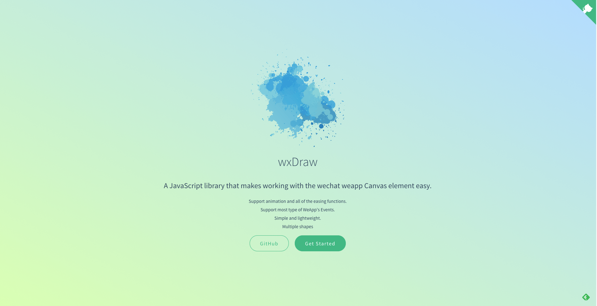
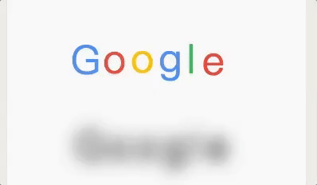
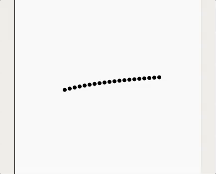
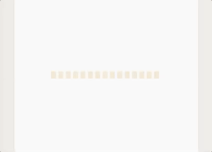
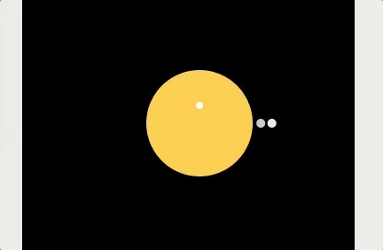
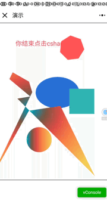

# wxDraw


「已经开始支持图形创建」

> 轻量的小程序canvas动画库

### [github](https://github.com/bobiscool/wxDraw)
###  [完整文档看这里](https://bobiscool.github.io/wxDrawDocs/#/)


## 是什么

canvas 是HTML5的一个重要元素，它能够高效的绘制图形，但是过于底层，且粗糙的Api，导致开发者很难使用它来做较为复杂的图形， 而且它的即时绘制无记忆特性，使得它内部的图形并不支持动画更不支持一切交互事件。

这样的问题出现在所有支持canvas的客户端上同样出现在 **微信小程序**中的canvas中， 由于小程序由**jsCore**支持，并没有**window对象**，并且canvas的Api与标准的canvas的Api**有所出入**，所以市面上绝大部分canvas库**与它无缘**。

而wxDraw也就应运而生，专门用于处理小程序上canvas的**图形创建**，**图形动画**，以及**交互**问题的。

## 特性

- **简单** 不需要你会canvas,会用jQuery就会使用wxDraw。
- **灵活** 所有图形，随时随地都可以进行属性修改、图形添加以及图形销毁。
- **事件支持** 小程序支持的事件只要是合理的都支持。
- **缓动动画支持** wxDraw支持链式调用动画『就像jQuery的animate一样』，并且支持几乎所有的缓动函数


## 支持图形


> 这里只做演示 详细文档 [点这里](http://project.ueflat.xyz/#/)

> 这些图形都可以在演示文件里看到 [点这里](https://github.com/bobiscool/wxDraw/tree/master/example)

### rect
```js
 var rect = new Shape('rect', {x: 60, y: 60, w: 40, h: 40, fillStyle: "#2FB8AC", rotate: Math.PI/2 },'mix', true);
```


### circle
```js
 let circle = new Shape('circle', { x: 100, y: 100, r: 40, sA: Math.PI/4, 
                             fillStyle: "#C0D860",
                            strokeStyle: "#CC333F", rotate: 20, lineWidth: 0, needGra: 'line', 
                              gra: [[0, '#00A0B0'], [0.2, '#6A4A3C'], [0.4, '#CC333F'], [0.6, '#EB6841'], [1, '#EDC951']]}, 
                           'fill', true)
```

### polygon
```js
let polygon = new Shape('polygon', { x: 200, y: 200, r: 40, sides: 9, //9边形
                          fillStyle: "#FC354C", rotate: Math.PI / 4 }, 'mix', true)
```

### ellipse
```js
    let ellipse = new Shape('ellipse', { x: 200, y: 200, a: 40, b: 100, 
                             fillStyle: "#00A0B0", rotate: Math.PI / 7 }, 'mix', true)
```


### image
图形对象

示例
```js
let img = new Shape('image', { x: 100, y: 300,w:100,h:100, file:"./1.png"}, 'fill', true)
  
```


### cshape 「自定义图形」
```js
  let cshape = new Shape('cshape', {
      rotate: Math.PI / 2,
      points: [[70, 85], [40, 20], [24, 46], [2, 4], [14, 6], [4, 46]],
      lineWidth: 5,
      fillStyle: "#00A0B0",
      rotate: Math.PI / 7,
      needGra: 'circle',
      smooth:false,
      gra: [[0, '#00A0B0'], [0.2, '#6A4A3C'], [0.4, '#CC333F'], [0.6, '#EB6841'], [1, '#EDC951']]
    }, 'fill', true)
```


### line
```js

let line = new Shape('line', { points:[[240,373],[11,32],[28,423],[12,105],[203,41],[128,0.06]], 
               strokeStyle: "#2FB8AC",lineWidth:1, rotate: 0, needShadow: true,smooth:false },  
               'fill', true)
```


### text

```js
  let text = new Shape('text', { x: 200, y: 200, text: "我是测试文字", 
                      fillStyle: "#E6781E", rotate: Math.PI / 3}
                      'fill', true)
```


## wxDraw创作的动画演示

> 这些动画都可以在演示文件里看到 [点这里](https://github.com/bobiscool/wxDraw/tree/master/example)

### Google

### 贪吃蛇


### logo演绎


### rect舞蹈


### 吃豆人 


## wxDraw事件


> 这些事件都可以在演示文件里看到 [点这里](https://github.com/bobiscool/wxDraw/tree/master/example)

支持

- tap
- touchStart
- touchEnd
- touchMove
- longPress
- drag「自定义的事件」


#### 事件演示

##### 旁边UI小妹妹亲自示范 😜

 
##### 第一视角 



**是不是特别简单，特别方便！！！
来，老铁们，star走一波！！！**


# TODO 

- 图形创建
    - [x] rect
    - [x] arc
        - [x] 扇形
        - [x] 圆
    - [x] polygon
        - [x] 正n边形
        - [x] 用户自己加的形状
        - [x] 光滑版用户自己加的形状
    -  [ ] ~image~
    -  [ ] 线条    
        -  [ ] ~贝塞尔曲线~『用的较少,绘制出来后 没法事件检测』
        -  [x] 普通线条
        -  [x] 光滑曲线
    - [ ] ~svg path~
    - [x] 椭圆
        - [x] 事件
        - [x] 动画
        - [x] 样式
    - [x] 字体
        - [x] 事件
        - [x] 动画
        - [x] 样式
    - [ ] 粒子动画元素『我觉得这个算另外一种系统 不属于形状』
-  [ ] 样式
    -  [x] 阴影
    -  [ ] 渐变   
    -  [x] 线宽
    -  [x] 线连接
    -  [x] 透明度

-  [x] 选中检测
    -  [x] rect
    -  [x] arc
        - [x] 整个圆形
        - [x] 扇形区域
    -  [x] polygon 区域 
        -  [x] 正多边形
        -  [x] 非规则多边形
    -  [x] 线条点击
    -  [x] 点 点击
    -  [x] 椭圆
    -  [x] 层级区分
-  [ ] 动画
    -  [x] requestAnimationFrame垫片
    -  [x] 时间扭曲函数
    -  [ ] 运动
        -  [x] 移动
            -  [x] x
            -  [x] y
        -  [ ] ~放大缩小 使用矩阵~**暂时搁浅**
        -  [x] 旋转
            -  [x]原点旋转
            -  [x]自身中心点旋转
        -  [x] 变色
        -  [x] 循环动画
        -  [x] 连续动画 
        -  [x] ~暂停动画~
    -  [ ] ~精灵图~『小程序 所支持的drawImage功能太低级 所以取消』

- [x] 矩阵变换
- [x] 层级修改
- [x] 事件
    - [x] touchstart
    - [x] touchmove 
    - [x] touchend
    - [x] 拖拽事件
    - [x] tap事件
    - [x] longpress事件
    - [ ] ~划入划出~「划入划出是鼠标的事件吧」    
- [x] 取消事件绑定
- [x] clone
    
